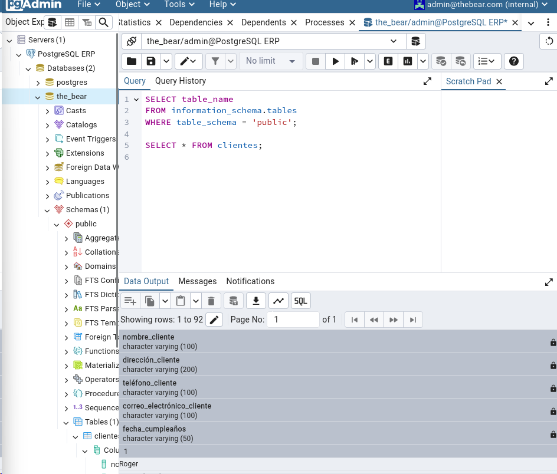
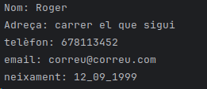
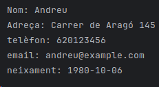

PAS 5
Podem veure com obrim la connexió i la tanquem amb èxit, com 

PAS 6
Introduïm dades del csv clients a la BD, es possible perque em establit conexio amb la base de dades i hem creat la taula clients

PAS7 COMPROVEM LA TAULA CREAT

PAS8 Agafa les dades de la taula cleints i les mostra

